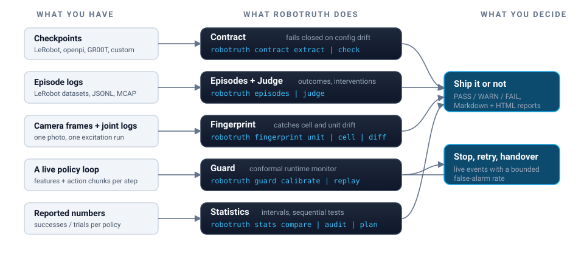

<div align="center">


<br/>

[](https://github.com/mulkakhileshmj/robotruth/actions/workflows/ci.yml)
[](https://github.com/mulkakhileshmj/robotruth/releases)
[](LICENSE)
[](pyproject.toml)
[](tests)

**Robot CI for learned robot policies.**
It tells a lab whether a policy change is real, before the robot, the eval, or the launch demo tells them the hard way.

[Why](#why-this-exists) · [What's inside](#whats-inside) · [Install](#install) · [Quickstart](#quickstart) · [Command reference](#command-reference) · [Python API](#python-api) · [Validation](#validated-on-real-data) · [License](#license)

</div>

---

## Why this exists

Robot learning has a measurement problem. These are published findings, not opinions:

| The field today | Source |
|---|---|
| 0 of 13 audited real-robot VLA papers report a confidence interval | PhAIL, arXiv 2605.29710 |
| A 50-trial success rate carries a 20 to 30 point wide 95% interval | Toyota Research Institute, LBM study |
| Moving a camera or a tote shifts task completion by 22 points, more than the gap between models | PhAIL |
| The same weights with different action-normalization metadata: 28/28 → 2/28 | "Same Weights, Different Robot", arXiv 2606.03724 |
| The same policy on a second, identical robot arm: 98% → 18% | SPACE, arXiv 2606.24049 |
| Video-only VLM success judges cap at 0.77 balanced accuracy, 0.52 on contact-rich tasks | FailBench, arXiv 2609.03611 |

robotruth is the layer that makes robot numbers mean something: **a number without an interval is not a result, and an evaluation of one configuration does not certify another.**

It is a Python library and CLI. It is not a benchmark, not a leaderboard, not a simulator, and not a model. It runs next to your own stack (LeRobot, openpi, GR00T, or anything else) and reads files.

## What's inside

<div align="center">

</div>

| Module | Question it answers | Command |
|---|---|---|
| **Contract** | Is the policy you evaluated the policy you deployed? Weights, normalizer statistics, action semantics, control rate, cameras, embodiment, hashed into a manifest and compared fail-closed. | `robotruth contract` |
| **Statistics** | Is checkpoint B really better than A? Intervals on every rate, paired designs, anytime-valid sequential tests, censored time-to-success, Bradley-Terry rankings, claims audits. | `robotruth stats` |
| **Episodes** | What actually happened in each rollout? One record per episode with outcome, interventions, failure class and provenance; fleet metrics nobody publishes (interventions/hour, MTBI, autonomous fraction); MCAP bridge for Foxglove. | `robotruth episodes` |
| **Fingerprint** | Did the cell or the robot unit change under you? Camera and lighting fingerprints from one frame; per-joint lag, backlash, offset and gain from one excitation run. `DriftDetector` calibrates the alarm threshold conformally when you have a population of fingerprints rather than a known tolerance: measured 3/270 false alarms at alpha 0.05, against 23/270 for a three-sigma rule, catching a 0.25 sd offset. | `robotruth fingerprint` |
| **Judge** | Did the episode succeed? Action-stream features fused with a vision-language model, split-conformal calibration with abstention, false alarms per hour reported. Open-weight VLM backend, so **no API key is required**. | `robotruth judge` |
| **Guard** | Has the robot stopped behaving like itself *right now*? Mahalanobis, chunk-consistency and action-statistics scores in one head, a stagnation score in its own head, both with time-uniform conformal thresholds calibrated on your own successful rollouts. Emits ok / slow / handover / stop. Measured on real robot logs: stalls and erratic control caught in **361/362 episodes** within 0.2 s, with **0/338 false alarms** in simulation. It detects *execution* faults, not task failures, see [Known limits](#known-limits). | `robotruth guard` |

Every report is written as **Markdown and styled HTML**, and every rate in it carries a confidence interval. The report layer refuses to print one without it.

## Install

```bash
pip install robotruth            # from a release wheel (see Releases) or PyPI when published
```

From source:

```bash
git clone https://github.com/mulkakhileshmj/robotruth.git
cd robotruth
uv venv .venv && uv pip install -e ".[dev]"
.venv/bin/python -m pytest -q    # 72 tests
```

Optional extras:

```bash
pip install "robotruth[open-vlm]"   # judge vision channel on your own GPU (Qwen-VL via transformers)
pip install "robotruth[vlm]"        # judge vision channel via the Claude API
pip install "robotruth[mcap]"       # MCAP bridge for Foxglove / Rerun
```

## Quickstart

**1. Certify that what you evaluated is what you deploy.**

```bash
robotruth contract extract runs/ckpt_0400/pretrained_model -o evaluated.json --role evaluated
robotruth contract extract /robot/current_policy -o deployed.json --role deployed
robotruth contract check evaluated.json deployed.json     # exit 1 on any fatal mismatch
```

The check fails closed: if it cannot *prove* the deployed tuple matches the evaluated one, the evaluation does not certify the deployment. Fields no checkpoint carries on disk (the gripper convention, which of several shipped normalizer statistics is live) are listed as `unverified` and supplied via a JSON overlay.

**2. Compare two policies like you mean it.**

```bash
robotruth stats plan --p-a 0.80 --p-b 0.90                # how many trials you need, before you start
robotruth stats schedule --policies base,cand --conditions pose1,pose2,pose3 --repeats 5
# ... run the schedule, record outcomes ...
robotruth stats compare results.csv --a base --b cand     # exit 1 if the candidate is worse
```

The report: Wilson intervals on every rate, a paired difference over matched trials, an **anytime-valid sequential verdict** (stop the moment it decides, since peeking is allowed by construction), censored time-to-success, and the number of trials you would need if the comparison is still noise.

**3. Turn your logs into the fleet metrics nobody publishes.**

```bash
robotruth episodes from-lerobot /data/my_dataset -o episodes.jsonl
robotruth episodes metrics episodes.jsonl --out-dir reports/   # HTML + Markdown
```

**4. Catch drift before it eats your eval.**

```bash
robotruth fingerprint cell top_cam.png --camera top -o cell_ref.json
robotruth fingerprint unit excitation.csv --unit-id arm_a -o unit_ref.json
robotruth fingerprint diff cell_ref.json cell_today.json       # exit 1 on drift beyond tolerance
```

**5. Judge outcomes and monitor live runs.**

```bash
robotruth judge run episodes.jsonl --backend open              # open-weight VLM, your GPU, no key
robotruth guard calibrate nominal_episodes/ -o guard.json      # thresholds from YOUR successful rollouts
robotruth guard replay guard.json episode.npz                  # ok / slow / handover / stop, exit 1 on alert
```

## Command reference

| Command | What it does |
|---|---|
| `robotruth contract extract PATH` | Build an ExecSpec manifest from a checkpoint dir or a probe dir (`--family`, `--role`, `--overlay`) |
| `robotruth contract check EVAL DEPLOY` | Fail-closed comparison of two manifests (`--allow-unknown`, `--out`) |
| `robotruth stats plan` | Required trials for a target comparison (`--p-a`, `--p-b`, `--power`, paired vs independent) |
| `robotruth stats schedule` | Blinded, interleaved A/B/n schedule with pair ids and a separate blinding key |
| `robotruth stats compare CSV` | Full comparison report, Markdown + HTML (`--a`, `--b`, `--margin`, `--alpha`) |
| `robotruth stats audit CSV` | Which reported success counts survive an interval (Newcombe + Fisher per task) |
| `robotruth stats interval K N` | Wilson and Clopper-Pearson interval for k successes of n |
| `robotruth episodes from-lerobot DIR` | Ingest a LeRobot dataset (v2/v3, DROID aliases, success + intervention columns) |
| `robotruth episodes validate LOG` | Schema-check a JSONL episode log |
| `robotruth episodes metrics LOG` | Fleet metrics with intervals; `--out-dir` writes the HTML report |
| `robotruth episodes to-results LOG` | Export to the results CSV `stats compare` consumes |
| `robotruth episodes to-mcap / from-mcap` | Round-trip episodes through MCAP (`/robotruth/episode`) for Foxglove |
| `robotruth episodes taxonomy` | Print the failure taxonomy (12 classes, 60 subclasses) |
| `robotruth fingerprint unit CSV` | Per-joint lag, backlash, RMSE, offset, gain from an excitation log |
| `robotruth fingerprint cell IMAGE` | Marker positions/poses, exposure, sharpness, colour balance from one frame |
| `robotruth fingerprint diff REF CUR` | Drift verdict against evidence-based tolerances, exit 1 on FAIL |
| `robotruth judge features / calibrate / run / evaluate` | Action-stream features; conformal calibration with abstain; judge a dataset; score against labels (balanced accuracy, false alarms/hour) |
| `robotruth guard calibrate / replay / metrics` | Fit scorers and time-uniform thresholds on nominal episodes; replay any episode step-by-step; detection and false-alarm accounting |

Every command that produces a verdict uses its **exit code** (0 pass, 1 fail), so all of it drops straight into CI.

## Python API

```python
from robotruth.contract import extract_spec, check_contract
from robotruth.stats import wilson, sequential_paired_test
from robotruth.schema import EpisodeLog, fleet_metrics
from robotruth.judge import HybridJudge, fit_fusion, fit_calibrator
from robotruth.judge.open_vlm import OpenVLMBackend          # no API key
from robotruth.guard import calibrate_guard, OfflineReplay

spec = extract_spec("runs/ckpt_0400/pretrained_model", role="evaluated")
result = check_contract(spec, extract_spec("/robot/policy", role="deployed"))
print(result.summary())                                       # PASS / FAIL with findings

verdict = sequential_paired_test(a_outcomes, b_outcomes, alpha=0.05)
print(verdict)   # e.g. "B_better after n=212: diff(B-A)=+0.101 [+0.012, +0.190]"
```

## Validated on real data

Everything below was measured by robotruth itself on public data (2026-09-18); the raw bundles live in [`examples/validation/2026-09-18`](examples/validation/2026-09-18).

- **54 public datasets ingested with zero errors** in the cross-dataset benchmark (RoboMIND and AgiBotWorld task ports, OpenX conversions, DROID, BotFails, DAgger and HIL-SERL logs), rendered as one HTML report: [`examples/validation/2026-09-19/benchmark/benchmark.html`](examples/validation/2026-09-19/benchmark/benchmark.html). Reproduce with `ops/benchmark_fetch.py`, `ops/validate_real.py` and `ops/benchmark_report.py`. Most public sets are demonstrations only, so the report states them as unlabelled instead of scoring them.
- **33 public datasets, 1,611 real robot episodes** ingested with zero errors in the earlier sweep.
- **A real DAgger deployment log**: 129.6 interventions/hour [120.9, 138.7], autonomous fraction 0.000 [0.000, 0.029]. That is what "assisted autonomy" looks like in numbers.
- **Five different physical SO-100/101 arms separated by fingerprint alone**: backlash 0.107 to 0.478, lag 101 to 135 ms.
- **RoboArena re-analysed**: 3,284 real pairwise sessions, 15 policies, Bradley-Terry ranking with bootstrap errors.
- **A 150-trial eval log audited**: 2 of 3 comparisons resolved at 95%; the third, a 10-point gap over 50 trials, is inside the noise.
- **A live policy loop** (ACT in gym-aloha, guard attached to every inference): judge balanced accuracy **0.929** [0.651, 0.987] with zero false alarms; the guard's conformal false-alarm bound held in every run. [Video](examples/validation/2026-09-18/live_guard/act_aloha_live_compat.mp4).
- **Guard on real robot logs** (2026-09-20, [`examples/validation/2026-09-20`](examples/validation/2026-09-20)): stalls and erratic control detected in **361 of 362** real episodes across three physical-robot corpora within 0.1 to 0.2 s, false alarms inside the 0.05 bound. The same replay also showed the guard is **near chance on real task failures** (AUROC 0.50 to 0.51), which corrected the scope of the claim rather than confirming it.
- **False alarms, on 338 held-out successes**: **0/338 = 0.000 [0.000, 0.011]**, replacing a bound whose interval previously reached 0.176.
- **The fingerprint's drift threshold is calibrated**: conformal at alpha 0.05 gives 3/270 false alarms against 23/270 for a three-sigma rule, with detection of a 0.25 sd offset unchanged at 268/270.
- **Guard detection, measured with faults that actually break the policy** (30/30 injected faults failed the task): stall, offset and noise faults all detected **30/30 = 1.000 [0.886, 1.000]** at **0.04 s median latency** on a 150-episode calibration pool. Faults that ramp in gradually over up to 4 s are still detected 100% of the time. Stalls needed a dedicated head: inside the averaged composite they scored 1/10, because a frozen action stream is self-consistent and in-distribution, so the stagnation score was diluted by three detectors reporting nominal. Both experiments are published side by side in `examples/validation/2026-09-19/guard_detection_v2/`. [Video of the guard watching a stall](examples/validation/2026-09-19/guard_detection_v2/multi_head/guard_stall_compat.mp4): a nominal episode where it stays quiet, then the same policy frozen mid-task, alarm raised 0.68 s after the stall in that episode.
- **The fused judge, on 323 labeled real episodes** (BotFails, 20 tasks, open-weight vision channel with no API key): fusing the action stream with the vision channel and calibrating takes the judge from answering everything at 0.614 balanced accuracy to answering a quarter of episodes at **0.921** [0.617, 0.972], with false alarms per hour cut from 11.1 to 2.7. The action channel alone abstains on everything, which is why fusion is the default.

| judge | coverage | balanced accuracy on decided | false alarms/hour |
|---|---|---|---|
| action-stream only | 0.000 | abstains on everything | 0.00 |
| vision only, uncalibrated | 1.000 | 0.614 [0.488, 0.727] | 11.13 [6.03, 19.20] |
| **fused, calibrated** | **0.258** [0.181, 0.353] | **0.921** [0.617, 0.972] | **2.73** [0.94, 7.41] |
- **Found in the wild during our own live test**: lerobot 0.6.1 silently drops an older checkpoint's normalization buffers, taking an 83% policy to 0% with only a log warning. The contract checker fails closed on precisely this.

## Known limits

Stated plainly, because a tool about honest measurement has to be honest about itself.

- **The guard detects execution faults, not task failures.** This is the most important limit here and it is measured, not assumed. Replayed against real robot logs, it caught 5/145 of BotFails' own failures and 0/58 of DROID's. A threshold-free AUROC per scorer head came out at 0.50 to 0.51 on BotFails and 0.33 to 0.44 on DROID, so there is no signal to recover and no threshold would help: a robot that fails a task keeps moving normally. What it does catch, it catches on real robots: stalls and erratic control in 153/153, 72/72 and 136/137 real episodes within 0.1 to 0.2 s, false alarms inside the bound. Use the judge for task failure and the fingerprint for miscalibration.
- **Constant offsets need about two standard deviations** before the guard sees them, and on one real corpus it never did (0/153 even at four). `DriftDetector` catches the same offsets at a quarter of a standard deviation, so miscalibration is the fingerprint's job, not the guard's.
- **False alarms and gradual faults are now measured properly**: 0/338 held-out successes, interval [0.000, 0.011], replacing 0.1.4's 0/18 whose interval reached 0.176. Faults that ramp in over up to 4 s are still detected 100% of the time, with the delay tracking how long the fault takes to grow rather than being a fixed lag. The `bonferroni` method still leaked at 45 calibration episodes, so `max` remains the default and 150 or more nominal episodes remains the guidance.
- **One policy, one task.** Every live number comes from ACT on aloha transfer cube. Three attempts at a second combination failed: the public insertion checkpoint completes the task 0/10 times, a community PushT checkpoint 1/8, and `lerobot/diffusion_pusht` faults the GPU on load. Measure the envelope again on your own robot with `robotruth guard metrics`.
- **The open-weight vision judge is weak on its own** (0.55 to 0.61 balanced accuracy). It is useful fused with the action channel and calibrated, as the table above shows. A frontier API backend is available behind the `[vlm]` extra and remains untested here.
- **No external users yet.** Everything in this repository has been exercised by its author on public data. Error messages, overlay ergonomics and the docs have not met a stranger.

## Methods and their sources

Wilson / Clopper-Pearson / Newcombe intervals and Fisher tests · empirical-Bernstein confidence sequences (Waudby-Smith & Ramdas, JRSS-B 2023; the idea behind TRI's STEP, RSS 2025) · Kaplan-Meier and log-rank on censored time-to-success (motivated by PhAIL) · Bradley-Terry with task buckets (RoboArena, CoRL 2025) · contract fields per "Same Weights, Different Robot", ROEP, SPACE and camera-conditioning results · episode schema per the ISO/TC 299 WG 16 gap statement · judge per FailBench, ActProbe, VLAConf · guard per FAIL-Detect (RSS 2025), VLA-FAIL, SAFECAST.

## Project layout

```
src/robotruth/contract/      ExecSpec manifests, extractors (LeRobot, openpi, GR00T, custom), fail-closed checker
src/robotruth/stats/         intervals, sequential tests, planning, censored timing, Bradley-Terry, blinded schedules
src/robotruth/schema/        episode records, failure taxonomy, LeRobot ingest, MCAP bridge, fleet metrics
src/robotruth/fingerprint/   robot-unit and workspace-cell fingerprints, drift reports
src/robotruth/judge/         hybrid outcome judge: features, fusion, conformal calibration, open + API VLM backends
src/robotruth/guard/         runtime monitor: scorers, conformal thresholds, hard limits, replay, metrics
ops/                         GPU-box scripts used for the validation runs
examples/                    real-checkpoint probes, manifests, and the full validation bundles
tests/                       72 tests, including simulation checks of interval coverage and false-alarm rates
```

## Contributing & citation

See [CONTRIBUTING.md](CONTRIBUTING.md). The ground rules are short: a rate without an interval is not a result, checks fail closed, adapters read files and never import policy frameworks, and design choices cite their evidence. Cite via [CITATION.cff](CITATION.cff).

## License

[Apache License 2.0](LICENSE).
